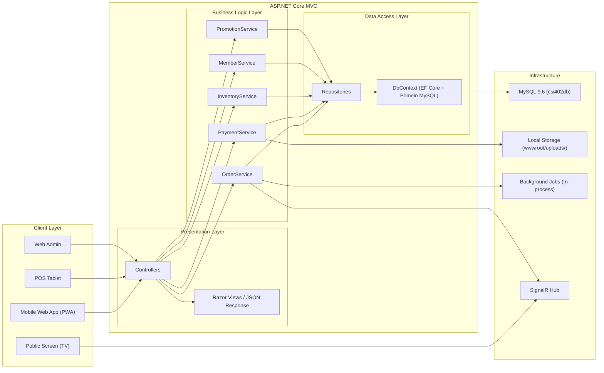
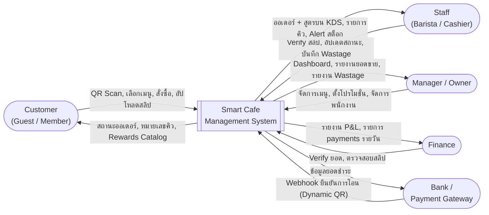
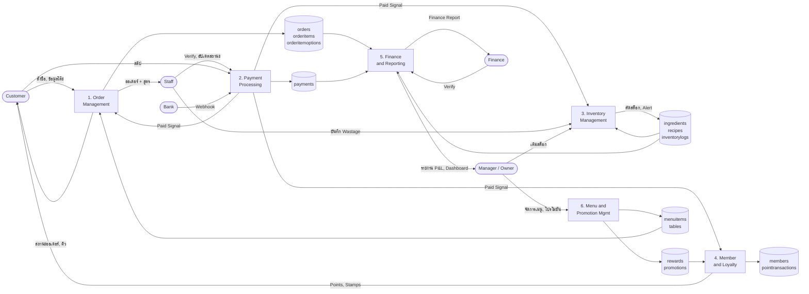
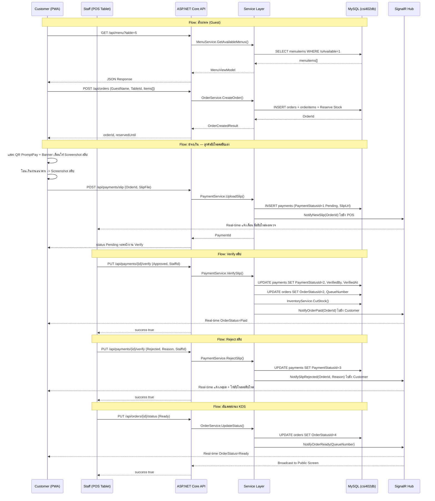

# Smart Cafe Management System: Design Blueprint (POS & Mobile Web App)

**เวอร์ชัน:** v8.0
**อัปเดตล่าสุด:** 15/04/2026

---

## บริบทโปรเจกต์ (Project Context)

- **ประเภทโปรเจกต์:** งานนักศึกษาชั้นปีที่ 3 สาขาวิทยาการคอมพิวเตอร์และนวัตกรรมการพัฒนาซอฟต์แวร์
- **กำหนดส่ง:** 5 เมษายน 2026
- **ขอบเขต:** Demo ได้ใช้งานได้จริงในระดับ Prototype ไม่ต้องเชื่อมต่อบริการภายนอกที่มีค่าใช้จ่าย

### ฟีเจอร์ที่อยู่ใน Demo Mode (ไม่เชื่อมระบบจริง)

| ฟีเจอร์ | แนวทาง Demo |
| :--- | :--- |
| Dynamic QR Payment (PromptPay / SCB API) | แสดง Static QR Code ภาพตัวอย่าง ไม่เชื่อม Payment Gateway จริง |
| Cloud Storage (AWS S3 / Azure Blob) | เก็บไฟล์สลิปใน `wwwroot/uploads/slips/` (Local) |
| JWT Authentication | ใช้ Session-based Authentication แทน (เหมาะกับ scope โปรเจกต์นี้) |
| Hangfire Background Jobs | ตรวจสอบ ReservedUntil แบบ In-process แทน ไม่ต้องติดตั้ง Hangfire |
| Email / SMS Notification | ข้ามทั้งหมด ไม่อยู่ใน scope |
| Export Excel / PDF | ข้ามทั้งหมด ไม่อยู่ใน scope |
| Group Check-in (Social Media Verify) | พนักงาน Manual กดอนุมัติเอง ไม่ต้องตรวจสอบจาก Facebook/Instagram จริง |
| Birthday Background Job | ตรวจสอบ ณ เวลา Checkout แทนการใช้ Scheduled Job |

---

## การติดตั้งและเริ่มต้นใช้งาน (Setup Guide)

### สิ่งที่ต้องติดตั้งก่อน

| โปรแกรม | เวอร์ชันขั้นต่ำ | หมายเหตุ |
| :--- | :--- | :--- |
| [.NET SDK](https://dotnet.microsoft.com/download) | 10.0 | ตรวจสอบด้วย `dotnet --version` |
| [MySQL Server](https://dev.mysql.com/downloads/mysql/) | 8.0 | ใช้ port 3306 (default) |
| [Azure Data Studio](https://azure.microsoft.com/en-us/products/data-studio) หรือ MySQL Workbench | — | สำหรับรัน SQL Script |

---

### ขั้นตอนที่ 1 — Clone โปรเจกต์

```bash
git clone https://github.com/InkSpuDek66/smart-cafe-management.git
cd smart-cafe-management
```

---

### ขั้นตอนที่ 2 — สร้างฐานข้อมูล

เปิด Azure Data Studio หรือ MySQL Workbench แล้วรัน SQL Script ตามลำดับนี้:

**2.1 สร้าง Schema + โครงสร้างตาราง + Seed Data หลัก**

```
เปิดไฟล์: SQLQuery_project.sql
รัน: Execute ทั้งไฟล์ (Ctrl+Shift+E)
```

**2.2 เพิ่มข้อมูลตัวอย่างสำหรับ Demo**

```
เปิดไฟล์: SQLSeedDemo.sql
รัน: Execute ทั้งไฟล์ (Ctrl+Shift+E)
```

> ทั้งสองไฟล์ต้องรันตามลำดับ และรันได้ครั้งเดียวจากศูนย์โดยไม่ต้องแก้ไข

---

### ขั้นตอนที่ 3 — ตรวจสอบ Connection String

เปิดไฟล์ `appsettings.json` ตรวจสอบให้ตรงกับ MySQL ในเครื่อง:

```json
{
  "ConnectionStrings": {
    "DefaultConnection": "server=localhost;port=3306;database=csi402db;user=root;password=root"
  }
}
```

แก้ไข `user` และ `password` ให้ตรงกับ MySQL ของตัวเองหากต่างจากค่าข้างต้น

---

### ขั้นตอนที่ 4 — รัน Restore และ Build

```bash
dotnet restore
dotnet build
```

> ไม่มี error แสดงว่าพร้อมใช้งาน

---

### ขั้นตอนที่ 5 — เริ่มต้นระบบ

```bash
dotnet run
```

เปิด browser ที่ `https://localhost:5043` หรือ `http://localhost:5044`

---

### URL สำคัญหลังจากรันระบบ

| Platform | URL | ผู้ใช้งาน |
| :--- | :--- | :--- |
| Mobile Web (ลูกค้า) | `/Customer/Menu?table=T01` | Guest / Member |
| POS Tablet | `/Pos/Queue` | Barista, Cashier |
| KDS (Barista) | `/Pos/Kds` | Barista |
| Admin Dashboard | `/Admin/Dashboard` | Manager, Finance, Owner |
| Public Screen | `/Public/Queue` | TV Display |

---

### ข้อมูล Login สำหรับ Demo

| Role | StaffId | Password |
| :--- | :--- | :--- |
| Owner | 690001 | 1234 |
| Store Manager | 690002 | 1234 |
| Finance | 690003 | 1234 |
| Cashier | 690004 | 1234 |
| Barista | 690005 | 1234 |

> ข้อมูลนี้มาจาก `SQLSeedDemo.sql` — ตรวจสอบไฟล์หากค่าต่างกัน

---

### โฟลเดอร์ที่ต้องสร้างหากไม่มี

ระบบต้องการโฟลเดอร์สำหรับเก็บไฟล์ที่ Upload หากโฟลเดอร์ไม่มีให้สร้างด้วยตนเอง:

```
wwwroot/uploads/slips/
wwwroot/uploads/menus/
```

---

## สารบัญ

1. [บทนำและภาพรวมระบบ](#1-บทนำและภาพรวมระบบ)
2. [ผู้ใช้งานและสิทธิ์](#2-ผู้ใช้งานและสิทธิ์)
3. [Workflow การทำงานหลัก](#3-workflow-การทำงานหลัก)
4. [การออกแบบ UXUI](#4-การออกแบบ-uxui)
5. [Database Schema](#5-database-schema)
6. [Business Logic Rules](#6-business-logic-rules)
7. [Promotions and Loyalty System](#7-promotions-and-loyalty-system)
8. [Tech Stack](#8-tech-stack)
9. [System Architecture and Diagrams](#9-system-architecture-and-diagrams)
10. [Gap Analysis and Recommendations](#10-gap-analysis-and-recommendations)
11. [Next Steps for Developer](#11-next-steps-for-developer)

---

## 1. บทนำและภาพรวมระบบ (System Overview)

ระบบบริหารจัดการร้านกาแฟแบบครบวงจร (End-to-End) ที่เน้นความรวดเร็วและความถูกต้องแม่นยำ รองรับลูกค้าทั้งสองกลุ่มคือ **สมาชิก (Member)** และ **ลูกค้าทั่วไป (Guest)** โดยระบบเชื่อมโยงการทำงานตั้งแต่การสั่งออเดอร์ที่โต๊ะ ไปจนถึงการตัดสต็อกและการลงบัญชีหลังบ้าน

### วัตถุประสงค์หลัก (Key Objectives)

1. **Frictionless Ordering:** ลูกค้าสั่งกาแฟได้ภายใน 30 วินาที โดยไม่ต้องถูกบังคับให้สมัครสมาชิก
2. **Zero-Loss Session:** แก้ปัญหาลูกค้าเผลอปิดหน้าจอแล้วออเดอร์หาย ด้วยฟีเจอร์ "Track Order by Table"
3. **Financial Integrity:** ปิดช่องโหว่การทุจริตด้วยการตรวจสอบสลิป (Slip Verification) หรือรองรับ Dynamic QR ในอนาคต
4. **Real-time Inventory and Costing:** ตัดสต็อกแม่นยำด้วยระบบสูตร (Recipes) และแยกประเภทของเสีย (Wastage) ชัดเจน
5. **Customer Retention:** กระตุ้นยอดขายผ่านระบบสะสมแต้ม (Points) บัตรสะสมแสตมป์ (Stamps) และโปรโมชั่นหลากหลาย

---

## 2. ผู้ใช้งานและสิทธิ์ (User Roles and Permissions)

**SQL Reference:** ตาราง `StaffRole` (1=Barista, 2=Cashier, 3=Store_Manager, 4=Finance, 5=Owner)

| Role | หน้าที่และความรับผิดชอบ | Platform ที่ใช้งาน |
| :--- | :--- | :--- |
| **Guest (ลูกค้าขาจร)** | สแกน QR, ดูเมนู, สั่งอาหาร (ไม่ต้อง Login), ติดตามสถานะด้วยเบอร์โต๊ะ | Mobile Web App (PWA) |
| **Member (สมาชิก)** | เหมือน Guest แต่เพิ่ม: สะสมแต้ม, ใช้แสตมป์, แลกของรางวัล, ดูประวัติการสั่ง | Mobile Web App (PWA) |
| **Barista** | ดูออเดอร์และสูตรเครื่องดื่มบนจอ KDS, อัปเดตสถานะรายการ, บันทึกของเสีย (Wastage) | POS Tablet + KDS |
| **Cashier** | รับออเดอร์, Verify สลิป, เคลียร์คิว, จัดการ Promotion ที่เคาน์เตอร์ | POS Tablet |
| **Store Manager** | แก้ไขเมนู (เปิด/ปิด), อนุมัติ Void Bill, ดู Dashboard, จัดการกะพนักงาน, ดูต้นทุน Wastage | Web Admin |
| **Finance** | ตรวจสอบยอดเงินเข้า Bank vs System, Verify สลิปรายวัน, ดูรายงาน P&L, ดูต้นทุนของเสีย | Web Admin |
| **Owner (เจ้าของร้าน)** | สิทธิ์สูงสุด: ดูรายงานทุกประเภท, จัดการ Staff และ Role ทุก Level, กำหนดโปรโมชั่น, เข้าถึงข้อมูลทางการเงินทั้งหมด, ตั้งค่าระบบ | Web Admin (Full Access) |
| **Public Screen** | (ไม่มีผู้ใช้งานโดยตรง) แสดงเลขคิวที่ทำเสร็จแล้ว | Smart TV / Monitor |

### สิทธิ์การเข้าถึงแต่ละ Module

| Module | Guest | Member | Barista | Cashier | Manager | Finance | Owner |
| :--- | :---: | :---: | :---: | :---: | :---: | :---: | :---: |
| สั่งอาหาร (QR) | R/W | R/W | - | - | - | - | - |
| KDS (ดูและอัปเดตคิว) | - | - | R/W | R | R | - | R/W |
| Payment Verification | - | - | - | R/W | R/W | R/W | R/W |
| เมนูจัดการ | - | - | - | - | R/W | - | R/W |
| Inventory / Wastage | - | - | W | W | R/W | R | R/W |
| Dashboard ยอดขาย | - | - | - | - | R | R | R |
| Finance Reconciliation | - | - | - | - | R | R/W | R/W |
| Staff Management | - | - | - | - | R/W | - | R/W |
| ตั้งค่าระบบ / Promotions | - | - | - | - | R | - | R/W |
| รายงาน P&L ทั้งหมด | - | - | - | - | R | R | R/W |

---

## 3. Workflow การทำงานหลัก (Core Workflows)

### 3.1 Flow การสั่งอาหารและชำระเงิน (Guest and Member Flow)

**Step 1: Scan and Identify**
- ลูกค้าสแกน QR Code ที่โต๊ะ (URL มี Parameter `?table_no=5`)
- System ตรวจสอบ `TableNumber` จากตาราง `tables` และแสดงหน้า Digital Menu

**Step 2: Selection and Stock Reservation**
- เลือกเมนู เลือก Option (ความหวาน, นม) บันทึกลง `orderitemoptions`
- เมื่อกด "Add to Cart" ระบบยังไม่ตัดสต็อก แต่จะเช็ค Availability
- เมื่อกด "Confirm Order" ระบบเพิ่มค่า `ReservedQty` ในตาราง `ingredients` และบันทึก `ReservedUntil` ในตาราง `orders`

**Step 3: Checkout Identification**
- ระบบถาม: "สะสมแต้มหรือไม่?"
  - Guest: กรอกชื่อเล่น (Nickname) บันทึกใน `orders.GuestName`
  - Member: กรอกเบอร์โทรศัพท์ ค้นหาจาก `members.Phone` เชื่อม `orders.MemberId`

**Step 4: Payment Processing**
- ระบบแสดงหน้า Payment พร้อม QR Code PromptPay และยอดที่ต้องโอน
- **แจ้งเตือนก่อนสแกน:** ระบบแสดง Banner "กรุณา Screenshot สลิปหลังโอนเงินสำเร็จ เพื่ออัปโหลดยืนยันในขั้นตอนถัดไป"
- ลูกค้าโอนเงินผ่านธนาคาร -> Screenshot สลิป -> อัปโหลดสลิปผ่านหน้าเว็บลูกค้าได้เลยบนมือถือ
- ระบบบันทึก `payments.SlipUrl` และตั้ง `PaymentStatusId = 1` (Pending) รอพนักงาน Verify
- POS แจ้งเตือนพนักงานทันทีว่ามีสลิปใหม่รอตรวจสอบ (Real-time ผ่าน SignalR)

**SQL Reference:** `paymentmethod` (1=Slip_Upload, 2=Dynamic_QR), `paymentstatus` (1=Pending, 2=Approved, 3=Rejected)

**Step 5: Production and Serving**
- `QueueNumber` ถูก Generate เฉพาะเมื่อ `OrderStatusId = 2` (Paid) เท่านั้น
- สถานะ Preparing: จอ KDS แสดงรายการพร้อมสูตรจากตาราง `recipes`
- เมื่อทำเสร็จ: บาริสต้ากด Done ตั้ง `OrderItemStatusId = 3`
- สถานะ Ready (`OrderStatusId = 4`): แจ้งเตือนลูกค้า ขึ้นจอ Public Screen

**Step 6: Completion**
- ลูกค้ามารับของ พนักงานกด Served/Clear ตั้ง `OrderStatusId = 5` (Completed)
- เลขคิวถูกลบออกจากจอทีวีหลังจาก 15 นาที หรือกด Served

**SQL Reference:** `orderstatus` (1=Waiting_Payment, 2=Paid, 3=Preparing, 4=Ready, 5=Completed, 6=Cancelled), `orderitemstatus` (1=Pending, 2=Preparing, 3=Done)

---

### 3.2 Flow การบริหารจัดการหลังบ้าน (Back-Office)

**1. Inventory and Recipes**
- Recipes Mapping: ผูกสูตรผ่านตาราง `recipes` เช่น Latte 1 แก้ว = เมล็ดกาแฟ 18g + นม 150ml
- เมื่อออเดอร์ Paid: ระบบอ่าน `recipes` ลด `ingredients.StockQuantity` บันทึก `inventorylogs` (ReasonTypeId=1=Sale)
- Wastage Record: พนักงานกดบันทึกผ่าน POS บันทึก `inventorylogs` (ReasonTypeId=2=Wastage) ตัดสต็อกแต่ไม่เพิ่มยอดขาย

**2. Menu Management (Menu 86)**
- วัตถุดิบหมด: Manager กดปิดเมนู อัปเดต `menuitems.IsAvailable = 0` ระบบ Signal ไปหน้าเว็บลูกค้าทันที

**3. Daily Finance Audit**
- ฝ่ายการเงินดูรายการ `payments` ทั้งหมดในวัน เทียบยอดกับ App ธนาคาร กด Verify (บันทึก `VerifiedBy` และ `VerifiedAt`)

**4. Promotions Management**
- ระบบตรวจสอบเงื่อนไขโปรโมชั่นอัตโนมัติ (ดูหัวข้อ 7)
- Redemption ทำผ่าน POS โดยพนักงาน บันทึก `pointtransactions`

**5. QR Code Management (Manager / Owner)**
- Manager เลือกโต๊ะใน Web Admin -> กด Generate QR Code ใหม่
- ระบบ Generate URL พร้อม Parameter `?table_no=X` -> อัปเดต `tables.QrCodeUrl`
- หน้าแสดง QR Code แบบ Print-ready ขนาด A4 พร้อมชื่อโต๊ะ -> Manager ปริ้นและนำไปติดโต๊ะได้ทันที

**6. Staff and Shift Management (Owner / Manager)**
- เจ้าของร้านและ Manager จัดการข้อมูลพนักงาน กะการทำงาน และสิทธิ์การเข้าถึง

---

## 4. การออกแบบ UX/UI (Wireframe Specifications)

### ส่วนที่ 1: Customer Side (Mobile Web App / PWA)

**1.1 Landing Page (หลังสแกน QR)**
- ระบบอ่าน `?table_no=X` ค้นหาจาก `tables.TableNumber`
- Re-join Session: เช็คออเดอร์ค้างของโต๊ะนี้ หากมี Redirect ไปหน้า Order Status ทันที

**1.2 Checkout Identification Screen**
- ถาม: "สะสมแต้มหรือไม่?"
  - Guest: กรอกชื่อเล่น
  - Member: กรอกเบอร์โทรศัพท์ แสดง: ชื่อสมาชิก | Points: XXX | Stamps: X/10

**1.3 Menu Screen**
- Header: ชื่อลูกค้า, Points, Stamps (สำหรับ Member)
- Categories Bar: New! | Seasonal | Coffee | Non-Coffee | Bakery
- Product List: รูปภาพ (`menuitems.ImageUrl`), ชื่อ (`menuitems.Name`), ราคา, ปุ่ม +Add
- เมนู Seasonal (`IsSeasonal = 1`) มีกรอบพิเศษตกแต่งตามเทศกาล
- เมนูที่ `IsAvailable = 0` แสดง Badge "Sold Out"

**1.4 Cart and Checkout**
- รายการสินค้า + Options (`orderitemoptions`)
- แสดงรายการแถม (Cookie ฟรี ถ้ายอด >= 300 บาท)
- ยอดรวม, ปุ่ม Confirm Order

**1.5 Payment Screen**
- แสดงยอดที่ต้องชำระ (`orders.NetAmount`) และ QR Code PromptPay
- **Banner เตือน:** "กรุณา Screenshot สลิปหลังโอนเงินสำเร็จ เพื่ออัปโหลดในขั้นตอนถัดไป"
- ปุ่ม "อัปโหลดสลิป" -> เปิด File Picker / Camera บนมือถือ -> Preview รูป -> ปุ่ม "ยืนยันการชำระเงิน"
- ระบบบันทึก `payments.SlipUrl` และแจ้ง POS ฝั่งพนักงานทันที
- หลังอัปโหลดสำเร็จ: แสดงข้อความ "รอพนักงานตรวจสอบสลิป..." พร้อม Loading indicator

**1.6 Order Status Screen**
- Real-time status: Waiting Payment -> Preparing -> Ready
- Track Order Tab: ปุ่มมุมขวาบน กรอกเบอร์โต๊ะ ดูสถานะได้ (แก้ปัญหาเปลี่ยนเครื่อง)

**1.7 Rewards Catalog**
- Grid แสดงของรางวัล (ชื่อ, คะแนนที่ใช้, จำนวนคงเหลือ) จากตาราง `rewards`
- หมายเหตุ: "กรุณาติดต่อพนักงานที่เคาน์เตอร์เพื่อแลกของรางวัล" (ไม่มีปุ่มกดแลกเอง)

---

### ส่วนที่ 2: Staff Side (POS Tablet)

**2.1 Order Queue (หน้าหลัก)**
- Split View:
  - Left Panel (Unpaid, สีแดง/ส้ม): `OrderStatusId = 1`
  - Right Panel (Paid/Processing, สีเขียว): `OrderStatusId = 2, 3, 4`
- Card Detail: เบอร์โต๊ะ, จำนวนรายการ, ยอดเงิน, เวลาที่สั่ง

**2.2 Payment Modal**
- แสดง: ชื่อลูกค้า/สมาชิก (`members.FirstName`), Points คงเหลือ, StampBalance
- Action Buttons (Promo):
  - [Apply Group Check-in Promo] ต้องใส่รหัสพนักงาน
  - [Redeem Reward] Popup เลือกของรางวัล ตัดแต้ม บันทึก `pointtransactions`
  - [Use Free Drink Stamp] Active เมื่อ `members.StampBalance >= 10`
- Payment Methods:
  - [CASH] ช่องกรอกตัวเลข บันทึก `payments` (ไม่มี SlipUrl)
  - [TRANSFER] แสดงสถานะ "รอลูกค้าอัปโหลดสลิป..." พร้อม indicator และแจ้งเตือนอัตโนมัติเมื่อลูกค้าอัปโหลดเสร็จ

**2.3 Slip Verification Panel**
- แจ้งเตือนบน POS ทันทีที่ลูกค้าอัปโหลดสลิป (Real-time ผ่าน SignalR)
- แสดงรูปสลิปขนาดใหญ่พร้อมข้อมูลออเดอร์ (โต๊ะ, ยอดเงิน, ชื่อลูกค้า)
- [Approve] ตั้ง `PaymentStatusId = 2` บันทึก `VerifiedBy` และ `VerifiedAt` -> ออเดอร์เข้าคิว KDS ทันที
- [Reject] ตั้ง `PaymentStatusId = 3` ระบุเหตุผล (สลิปปลอม/ยอดไม่ตรง/สลิปซ้ำ) -> แจ้งเตือนลูกค้าให้อัปโหลดใหม่

**2.4 KDS (Kitchen Display System)**
- แสดง Ticket เรียงตามคิว (`QueueNumber`)
- Ticket Detail: ชื่อเมนู, Options (หวาน/นม), Note, สูตรเครื่องดื่มจาก `recipes`
- [Done] ตั้ง `OrderItemStatusId = 3`
- [Call Customer] จอทีวีกระพริบ/มีเสียง
- [Served / Picked Up] ตั้ง `OrderStatusId = 5` ลบออกจากจอทีวี

**2.5 Wastage Recording**
- เลือกวัตถุดิบ/เมนู ระบุปริมาณ เลือกเหตุผล (ชงผิด, หก, หมดอายุ)
- บันทึก `inventorylogs` (ReasonTypeId=2=Wastage)

---

### ส่วนที่ 3: Web Admin (Manager, Finance, Owner)

**3.1 Dashboard (Manager / Owner)**
- Graph: ยอดขายรายชั่วโมงของวันนี้
- Top 5 Best Sellers
- Stock Alerts (วัตถุดิบที่ `StockQuantity < ReorderLevel`)
- Wastage Cost Summary (ต้นทุนของเสียแยกออกมาให้ตรวจสอบ)

**3.2 Finance Reconciliation (Finance / Owner)**
- Table: Order ID | เวลา | โต๊ะ | ยอดเงิน | รูปสลิป (คลิก Zoom) | Status | Verify By
- สรุปยอดรายวัน: เงินสด vs โอน vs ยอดในระบบ
- P&L Report: Revenue - COGS (Sale + Wastage) - Expenses

**3.3 Menu Management (Manager / Owner)**
- เพิ่ม/แก้ไข/ปิดเมนู (`menuitems.IsAvailable`)
- จัดการเมนู Seasonal (`IsSeasonal`, `SeasonStartDate`, `SeasonEndDate`)
- ตั้งสูตรเครื่องดื่ม (`recipes`)
- กำหนดราคาและ Options

**3.4 Inventory and Procurement (Manager / Owner)**
- ดูสต็อกปัจจุบัน, บันทึกการเติมของ `inventorylogs` (ReasonTypeId=3=Restock)
- แจ้งเตือนสต็อกต่ำ (`StockQuantity < ReorderLevel`)
- รายงานต้นทุนวัตถุดิบ

**3.5 Staff Management (Manager / Owner)**
- จัดการข้อมูลพนักงาน (`staff`) และ Role (`staffrole`)
- จัดการกะพนักงาน (`StaffShifts`)
- Owner เท่านั้นที่สามารถเพิ่ม/ลบ Manager และ Finance ได้

**3.6 Promotions Management (Owner)**
- จัดการโปรโมชั่นทั้งหมดผ่านตาราง `Promotions`
- กำหนดเงื่อนไข เปิด/ปิดโปรโมชั่นได้แบบ Dynamic
- ดูสถิติการใช้งานโปรโมชั่นแต่ละชนิด

**3.7 QR Code Management (Manager / Owner)**
- เลือกโต๊ะที่ต้องการ -> กด Generate QR Code ใหม่ -> ระบบอัปเดต `tables.QrCodeUrl`
- หน้า Preview QR Code แบบ Print-ready ขนาด A4 พร้อมหมายเลขโต๊ะ -> ปริ้นออกมาติดโต๊ะได้ทันที

**3.8 Reports (Manager / Owner)**

รายงานยอดขายและพฤติกรรมลูกค้า ดึงข้อมูลจาก `orders`, `orderitems`, `orderitemoptions`, `payments`

- รายงานยอดขายแยกตามช่วงเวลาของวัน (รายชั่วโมง) เพื่อดูว่า Peak Hour อยู่ช่วงไหน
- รายงานยอดขายแยกตามวันในสัปดาห์ (จันทร์-อาทิตย์) เพื่อดูว่าวันไหนลูกค้าเยอะที่สุด
- รายงานยอดขายแยกตามเดือน เพื่อดู Trend รายเดือน
- รายงานยอดขายแยกตามไตรมาส เพื่อดูภาพรวม Q1-Q4
- รายงานยอดขายแยกตามปี เพื่อเปรียบเทียบ Year-over-Year
- รายงานยอดขายแยกตามเมนู เพื่อวิเคราะห์ว่าเมนูไหนขายดีหรือไม่ดี
- รายงานการชำระเงินแยกตามช่องทาง (เงินสด vs โอน) เพื่อวิเคราะห์ความนิยมของแต่ละช่องทาง
- รายงานความนิยมของ Menu Options (ความหวาน, ประเภทนม, Extra Shot) โดย Query จาก `orderitemoptions` เพื่อวิเคราะห์ว่าลูกค้านิยมตัวเลือกไหนมากที่สุด
- รายงานของเสีย (Wastage) แยกตามเมนูและวัตถุดิบ เพื่อวิเคราะห์ว่ารายการไหนมีของเสียมากผิดปกติ โดย Query จาก `inventorylogs` (ReasonTypeId=2) เทียบกับ `recipes`

---

## 5. Database Schema

**ฐานข้อมูล:** `CSI402DB` — MySQL 9.6.0

### 5.1 Reference Tables

| Table | ID และ Value |
| :--- | :--- |
| `OrderStatus` | 1=Waiting_Payment, 2=Paid, 3=Preparing, 4=Ready, 5=Completed, 6=Cancelled |
| `OrderItemStatus` | 1=Pending, 2=Preparing, 3=Done |
| `InventoryReasonType` | 1=Sale, 2=Wastage, 3=Restock |
| `StaffRole` | 1=Barista, 2=Cashier, 3=Store_Manager, 4=Finance, 5=Owner |
| `PaymentMethod` | 1=Slip_Upload, 2=Dynamic_QR |
| `PaymentStatus` | 1=Pending, 2=Approved, 3=Rejected |
| `PointTransactionType` | 1=Earn, 2=Redeem, 3=StampEarn, 4=StampRedeem |

---

### 5.2 Core Tables

#### Tables
| Column | Type | Description |
| :--- | :--- | :--- |
| `TableId` | INT PK | Unique ID |
| `TableNumber` | NVARCHAR(10) | เลขโต๊ะ ตรงกับ QR Code |
| `QrCodeUrl` | NVARCHAR(255) | URL ของ QR Code |
| `IsActive` | BIT | 1=พร้อมใช้งาน, 0=ปิดใช้งาน |

#### Members
| Column | Type | Description |
| :--- | :--- | :--- |
| `MemberId` | INT PK | รูปแบบ BBNNNN (6 หลัก) — BB=2 หลักท้ายปี พ.ศ., NNNN=Running Number 0001-9999, เช่น ปี 2569 คนแรก = 690001 |
| `Phone` | NVARCHAR(20) | เบอร์โทร (Candidate Key) ใช้ค้นหาและ Login |
| `FirstName` | NVARCHAR(50) | ชื่อจริง |
| `LastName` | NVARCHAR(50) | นามสกุล |
| `BirthDate` | DATE | วันเกิด (ใช้คำนวณโปรโมชั่นวันเกิด) |
| `Points` | INT | แต้มสะสมคงเหลือ |
| `StampBalance` | INT | จำนวนแสตมป์คงเหลือ |

#### Staff
| Column | Type | Description |
| :--- | :--- | :--- |
| `StaffId` | INT PK | รูปแบบ BBNNNN (6 หลัก) — BB=2 หลักท้ายปี พ.ศ., NNNN=Running Number 0001-9999, เช่น ปี 2569 คนแรก = 690001 |
| `StaffRoleId` | INT FK -> StaffRole | บทบาทพนักงาน |
| `FirstName` | NVARCHAR(50) | ชื่อจริง |
| `LastName` | NVARCHAR(50) | นามสกุล |
| `Username` | NVARCHAR(50) | ชื่อผู้ใช้สำหรับ Login |
| `PasswordHash` | NVARCHAR(255) | รหัสผ่านแบบ Hash |
| `IsActive` | BIT | 1=ยังทำงานอยู่, 0=ออกแล้ว |

#### MenuItems
| Column | Type | Description |
| :--- | :--- | :--- |
| `MenuItemId` | INT PK | Unique ID |
| `MenuName` | NVARCHAR(150) | ชื่อเมนู |
| `MenuDescription` | NVARCHAR(500) | รายละเอียดเมนู |
| `Price` | DECIMAL(10,2) | ราคาขาย |
| `Category` | NVARCHAR(50) | หมวดหมู่ (Coffee, Non-Coffee, Food, Bakery) |
| `IsAvailable` | BIT | 1=มีขาย, 0=ปิดชั่วคราว |
| `ImageUrl` | NVARCHAR(255) | URL รูปภาพเมนู |
| `IsSeasonal` | BIT | 1=เมนูตามฤดูกาล, 0=เมนูปกติ |
| `SeasonStartDate` | DATE | วันเริ่มต้นเมนู Seasonal (NULL ได้) |
| `SeasonEndDate` | DATE | วันสิ้นสุดเมนู Seasonal (NULL ได้) |

#### Ingredients
| Column | Type | Description |
| :--- | :--- | :--- |
| `IngredientId` | INT PK | Unique ID |
| `IngredientName` | NVARCHAR(150) | ชื่อวัตถุดิบ |
| `StockQuantity` | FLOAT | ยอดสต็อกปัจจุบัน |
| `ReservedQty` | FLOAT | ยอดที่ถูก Reserve ชั่วคราว |
| `Unit` | NVARCHAR(20) | หน่วย (ml, g, piece) |
| `ReorderLevel` | FLOAT | แจ้งเตือนเมื่อสต็อกต่ำกว่านี้ |
| `CostPerUnit` | DECIMAL(10,4) | ต้นทุนต่อหน่วย (ใช้คำนวณ COGS) |

#### Recipes
| Column | Type | Description |
| :--- | :--- | :--- |
| `RecipeId` | INT PK | Unique ID |
| `MenuItemId` | INT FK -> MenuItems | เมนูที่ใช้สูตรนี้ |
| `IngredientId` | INT FK -> Ingredients | วัตถุดิบที่ใช้ |
| `QuantityRequired` | FLOAT | ปริมาณที่ใช้ต่อ 1 แก้ว/ชิ้น |
| `Unit` | NVARCHAR(20) | หน่วย (ml, g) |

#### Rewards
| Column | Type | Description |
| :--- | :--- | :--- |
| `RewardId` | INT PK | Unique ID |
| `RewardName` | NVARCHAR(150) | ชื่อของรางวัล |
| `PointsRequired` | INT | แต้มที่ต้องใช้แลก |
| `StockQuantity` | INT | จำนวนของรางวัลคงเหลือ |
| `ImageUrl` | NVARCHAR(255) | URL รูปของรางวัล |
| `IsActive` | BIT | 1=เปิดให้แลก, 0=ปิด |

#### Promotions
| Column | Type | Description |
| :--- | :--- | :--- |
| `PromotionId` | INT PK | Unique ID |
| `PromotionName` | NVARCHAR(150) | ชื่อโปรโมชั่น |
| `ConditionType` | NVARCHAR(50) | ประเภทเงื่อนไข เช่น MinAmount, StampCount, Birthday |
| `ConditionValue` | NVARCHAR(255) | ค่าเงื่อนไข เช่น '300' หรือ '10' (ตีความที่ Backend) |
| `RewardType` | NVARCHAR(50) | ประเภทรางวัล เช่น FreeItem, Discount |
| `RewardValue` | NVARCHAR(255) | ค่ารางวัล เช่น MenuItemId หรือ DiscountAmount |
| `IsActive` | BIT | 1=โปรโมชั่นเปิดอยู่, 0=ปิด |
| `StartDate` | DATE | วันที่เริ่มใช้ (NULL = ไม่มีวันหมดอายุ) |
| `EndDate` | DATE | วันที่สิ้นสุด (NULL = ไม่มีวันหมดอายุ) |

#### Orders
| Column | Type | Description |
| :--- | :--- | :--- |
| `OrderId` | INT PK | Unique ID |
| `MemberId` | INT FK -> Members | FK อ้างอิง Members.MemberId, NULL ถ้าเป็น Guest |
| `TableId` | INT FK -> Tables | โต๊ะที่สั่ง |
| `OrderStatusId` | INT FK -> OrderStatus | สถานะออเดอร์ปัจจุบัน |
| `GuestName` | NVARCHAR(100) | ชื่อเล่น Guest (NULL ถ้าเป็น Member) |
| `QueueNumber` | NVARCHAR(10) | เลขคิว A001 (Generate เมื่อ Paid เท่านั้น) |
| `TotalAmount` | DECIMAL(10,2) | ยอดรวมก่อนส่วนลด |
| `DiscountAmount` | DECIMAL(10,2) | ยอดส่วนลดทั้งหมด |
| `NetAmount` | DECIMAL(10,2) | ยอดที่ต้องชำระจริง |
| `ReservedUntil` | DATETIME | หมดเวลา Reserve สต็อก |
| `CreatedAt` | DATETIME | เวลาสร้างออเดอร์ |

#### OrderItems
| Column | Type | Description |
| :--- | :--- | :--- |
| `OrderItemId` | INT PK | Unique ID |
| `OrderId` | INT FK -> Orders | ออเดอร์ที่สังกัด |
| `MenuItemId` | INT FK -> MenuItems | เมนูที่สั่ง |
| `OrderItemStatusId` | INT FK -> OrderItemStatus | สถานะของรายการนี้ |
| `Quantity` | INT | จำนวนที่สั่ง |
| `UnitPrice` | DECIMAL(10,2) | ราคา ณ เวลาที่สั่ง (Price Snapshot) |

#### OrderItemOptions
| Column | Type | Description |
| :--- | :--- | :--- |
| `OrderItemOptionId` | INT PK | Unique ID |
| `OrderItemId` | INT FK -> OrderItems | รายการที่เชื่อมถึง |
| `OptionName` | NVARCHAR(100) | ชื่อตัวเลือก เช่น Sweetness |
| `OptionValue` | NVARCHAR(100) | ค่าที่เลือก เช่น Less Sugar 25% |
| `PriceAdjustment` | DECIMAL(10,2) | ราคาที่เพิ่ม/ลด เช่น +15.00 |

#### Payments
| Column | Type | Description |
| :--- | :--- | :--- |
| `PaymentId` | INT PK | Unique ID |
| `OrderId` | INT FK -> Orders | ออเดอร์ที่ชำระ |
| `PaymentMethodId` | INT FK -> PaymentMethod | ช่องทางการชำระ |
| `PaymentStatusId` | INT FK -> PaymentStatus | สถานะการชำระ |
| `Amount` | DECIMAL(10,2) | ยอดที่ชำระ |
| `SlipUrl` | NVARCHAR(255) | URL รูปสลิปที่ลูกค้าอัปโหลด (NULL ถ้าเป็นเงินสด) |
| `VerifiedBy` | INT FK -> Staff | Staff ที่กด Approve/Reject |
| `VerifiedAt` | DATETIME | เวลาที่ Verify |
| `RejectReason` | NVARCHAR(255) | เหตุผลที่ Reject สลิป เช่น สลิปไม่ชัดเจน / ยอดไม่ตรง / สลิปซ้ำ (NULL ถ้า Approve) |

#### InventoryLogs
| Column | Type | Description |
| :--- | :--- | :--- |
| `LogId` | INT PK | Unique ID |
| `IngredientId` | INT FK -> Ingredients | วัตถุดิบที่เปลี่ยน |
| `ReasonTypeId` | INT FK -> InventoryReasonType | เหตุผล (Sale/Wastage/Restock) |
| `RefOrderId` | INT FK -> Orders | อ้างอิงออเดอร์ (เฉพาะกรณี Sale) |
| `CreatedBy` | INT FK -> Staff | Staff ที่บันทึก |
| `QuantityChange` | FLOAT | ค่าลบ=ลดสต็อก, ค่าบวก=เพิ่มสต็อก |
| `CreatedAt` | DATETIME | เวลาที่บันทึก |

#### PointTransactions
| Column | Type | Description |
| :--- | :--- | :--- |
| `TransId` | INT PK | Unique ID |
| `MemberId` | INT FK -> Members | FK อ้างอิง Members.MemberId |
| `TypeId` | INT FK -> PointTransactionType | ประเภท (Earn/Redeem/StampEarn/StampRedeem) |
| `Amount` | INT | จำนวนแต้มหรือแสตมป์ (บวก=ได้รับ, ลบ=ใช้ไป) |
| `RefOrderId` | INT FK -> Orders | อ้างอิงออเดอร์ที่ทำให้เกิดแต้ม (NULL ถ้า Redeem) |
| `CreatedBy` | INT FK -> Staff | Staff ที่กด Redeem (NULL ถ้าระบบ Earn อัตโนมัติ) |
| `CreatedAt` | DATETIME | เวลาที่บันทึก |

#### StaffShifts
| Column | Type | Description |
| :--- | :--- | :--- |
| `ShiftId` | INT PK | Unique ID |
| `StaffId` | INT FK -> Staff | FK อ้างอิง Staff.StaffId |
| `ShiftStart` | DATETIME | เวลาเริ่มกะ (Clock In) |
| `ShiftEnd` | DATETIME | เวลาสิ้นสุดกะ (Clock Out) NULL = ยังไม่ Clock Out |
| `CreatedAt` | DATETIME | เวลาที่บันทึก Record นี้ |

---

## 6. Business Logic Rules

### 6.1 Stock Reservation (Time-based)
```
เมื่อ Confirm Order:
  -> เพิ่ม ingredients.ReservedQty += QuantityRequired (จาก recipes)
  -> บันทึก orders.ReservedUntil = NOW() + 5 นาที

Background Job (ทุก 1 นาที):
  -> ค้นหา orders ที่ OrderStatusId = 1 และ ReservedUntil < NOW()
  -> คืน ingredients.ReservedQty
  -> อัปเดต orders.OrderStatusId = 6 (Cancelled)
```

### 6.2 Ghost Order Prevention
```
QueueNumber Generate เมื่อ OrderStatusId = 2 (Paid) เท่านั้น
Format: A001, A002, ... (รีเซ็ตทุกวัน)
```

### 6.3 Inventory Cut-off (เมื่อ Paid)
```
เมื่อ OrderStatusId เปลี่ยนเป็น Paid:
  -> สำหรับแต่ละ orderitems:
    -> อ่าน recipes ตาม MenuItemId
    -> ลด ingredients.StockQuantity -= (QuantityRequired x Quantity)
    -> ลด ingredients.ReservedQty  -= (QuantityRequired x Quantity)
    -> บันทึก inventorylogs (ReasonTypeId=1, RefOrderId=OrderId)
```

### 6.4 Wastage Calculation
```
กำไรสุทธิ = Revenue - COGS(จากยอดขาย) - Cost(จาก Wastage) - Expenses
```
แสดง Cost ของ Wastage แยกใน Dashboard เพื่อให้ Manager/Owner ตรวจสอบความผิดปกติ

### 6.5 Payment Rules
```
orders เปลี่ยนเป็น Paid ไม่ได้ ถ้า:
  - เลือก Transfer แต่ไม่มี SlipUrl
  - PaymentStatusId ยังเป็น Pending หรือ Rejected
```

### 6.6 Slip Rejection Flow
```
ถ้า PaymentStatusId = 3 (Rejected):
  -> SignalR แจ้งเตือนหน้า Payment Screen ของลูกค้าทันที
  -> แสดงเหตุผลที่พนักงาน Reject (สลิปปลอม/ยอดไม่ตรง/สลิปซ้ำ)
  -> ลูกค้าอัปโหลดสลิปใหม่ได้เลยจากหน้าเดิม
  -> หรือกด Cancel Order -> คืน ReservedQty
```

### 6.7 Auto Reorder Alert
```
หลังจาก Inventory Cut-off:
  -> ตรวจสอบ ingredients.StockQuantity < ingredients.ReorderLevel
  -> ถ้าใช่: สร้าง Alert ส่งไปยัง Dashboard ของ Manager และ Owner
```

---

## 7. Promotions and Loyalty System

### 7.1 โปรโมชั่นที่มีในระบบ

| ลำดับ | โปรโมชั่น | เงื่อนไข | การดำเนินการ |
| :--- | :--- | :--- | :--- |
| 1 | สะสมแต้ม | สมัครสมาชิก + ซื้อสินค้า | 10 บาท = 1 แต้ม (FLOOR(NetAmount / 10)) |
| 2 | เมนู Seasonal | ตามช่วงเทศกาล | แสดงเมนูพิเศษที่มีกรอบตกแต่ง |
| 3 | Free Cookie | ยอดสั่ง >= 300 บาท | Add Cookie (ราคา 0) ลงตะกร้าอัตโนมัติ |
| 4 | Stamp Card | สั่งเครื่องดื่มครบ 10 แก้ว | เลือกรับเมนูฟรี 1 แก้ว (แลกที่เคาน์เตอร์) |
| 5 | Group Check-in | >= 5 คน Check-in Facebook/Instagram | รับเครื่องดื่มฟรี 1 แก้ว (พนักงาน Verify) |

### 7.2 Point Calculation Logic
```
เมื่อ OrderStatusId = 2 (Paid):
  -> NetAmount = SUM(UnitPrice x Quantity) + SUM(PriceAdjustment) - DiscountAmount
  -> PointsEarned = FLOOR(NetAmount / 10)
  -> อัปเดต Members.Points += PointsEarned
  -> บันทึก PointTransactions (TypeId=1 Earn, Amount=PointsEarned, RefOrderId=OrderId)
```

### 7.3 Stamp Logic
```
เมื่อ OrderStatusId = 2 (Paid):
  -> นับ OrderItems ที่ MenuItems.Category = 'Coffee' หรือ 'Non-Coffee'
  -> StampsEarned = จำนวน Beverage ที่สั่ง
  -> อัปเดต Members.StampBalance += StampsEarned
  -> บันทึก PointTransactions (TypeId=3 StampEarn, Amount=StampsEarned)

เมื่อ Members.StampBalance >= 10 และพนักงานกด [Use Free Drink Stamp]:
  -> สร้าง OrderItems ใหม่ (ราคา 0)
  -> อัปเดต Members.StampBalance -= 10
  -> บันทึก PointTransactions (TypeId=4 StampRedeem, Amount=-10, CreatedBy=StaffId)
```

### 7.4 Group Check-in Logic
```
พนักงานได้รับหลักฐาน Check-in จากลูกค้า (Screenshot)
  -> พนักงานกด [Apply Group Check-in Promo] ใส่รหัสพนักงาน
  -> ระบบสร้าง orderitems ใหม่ (Free Drink, ราคา 0)
  -> บันทึก Log การใช้ Promotion
```

### 7.5 Birthday Promotion Logic
```
Background Job (ทุกวัน เวลา 00:00):
  -> ค้นหา members ที่ MONTH(BirthDate) = MONTH(TODAY) และ DAY(BirthDate) = DAY(TODAY)
  -> สำหรับแต่ละ member ที่เจอ:
    -> สร้าง Record ใน promotions หรือบันทึก Birthday Flag ให้สมาชิก
    -> เมื่อสมาชิกนั้นสั่งออเดอร์ในวันเกิด -> ระบบ Apply ส่วนลดหรือของรางวัลตามที่ตั้งค่าไว้ใน promotions

หมายเหตุ: เงื่อนไขและรางวัลวันเกิดกำหนดได้ใน promotions (ConditionType='Birthday')
ตัวอย่าง: ConditionValue='birthday', RewardType='Discount', RewardValue='10' (ลด 10%)
```

### 7.6 Redemption Rules
- การแลกของรางวัลทำได้เฉพาะที่หน้า POS โดยพนักงาน
- การใช้ Free Drink (10 แสตมป์) ทำได้ที่หน้า POS โดยพนักงาน
- ต้องบันทึก `pointtransactions` ทุกครั้ง

---

## 8. Tech Stack

### Backend
| เทคโนโลยี | รายละเอียด |
| :--- | :--- |
| Framework | ASP.NET Core MVC |
| Language | C# |
| ORM | Entity Framework Core + Pomelo.EntityFrameworkCore.MySql |
| Database | MySQL 9.6 (csi402db) |
| Database Tool | Azure Data Studio |
| Real-time | SignalR (WebSocket) สำหรับ Order Status และ Public Screen |
| Background Jobs | In-process (ตรวจสอบ `ReservedUntil` ใน Controller — ไม่ใช้ Hangfire) |
| Authentication | Session-based (`HttpContext.Session`) |
| File Storage | Local (`wwwroot/uploads/slips/` และ `wwwroot/uploads/menus/`) |

### Frontend
| เทคโนโลยี | รายละเอียด |
| :--- | :--- |
| CSS Framework | **Tailwind CSS v3** (โหลดผ่าน CDN: `cdn.tailwindcss.com`) |
| Component Library | **DaisyUI v4.12.14** (โหลดผ่าน CDN: `cdn.jsdelivr.net/npm/daisyui@4.12.14`) |
| Icon Library | **Heroicons** (ใช้เป็น inline SVG เท่านั้น — ไม่ต้องติดตั้ง package) |
| Template Engine | Razor Views (.cshtml) — ASP.NET Core MVC |
| Mobile Web App | PWA (Progressive Web App) — เข้าถึงผ่าน QR Code, ไม่ต้องโหลดแอป |

### การตั้งค่า UI (สำคัญ)

ทุก Layout ใช้ CDN 2 ไฟล์นี้ในส่วน `<head>`:

```html
<!-- DaisyUI ต้องมาก่อน Tailwind -->
<link href="https://cdn.jsdelivr.net/npm/daisyui@4.12.14/dist/full.min.css" rel="stylesheet" />
<script src="https://cdn.tailwindcss.com"></script>
```

#### กฎการใช้ Tailwind CSS
- ใช้ Tailwind utility classes แทน inline `style="..."` ทุกกรณี
- CSS `linear-gradient` และ Razor-computed values (`style="width:@x%"`) ยกเว้นได้
- `grid-template-columns` ที่ซับซ้อนใช้ Tailwind arbitrary values: `class="grid [grid-template-columns:repeat(auto-fit,minmax(200px,1fr))]"`

#### กฎการใช้ DaisyUI
- ปุ่ม: `btn btn-sm`, `btn-primary`, `btn-error`, `btn-success`, `btn-outline`
- Alert: `alert alert-success`, `alert alert-error`
- ตาราง: `table table-zebra w-full`
- Badge: `badge badge-warning`, `badge badge-error`
- Modal: `modal modal-box`
- Loading: `loading loading-spinner`

#### กฎการใช้ Heroicons (สำคัญมาก)
- **ใช้ Heroicons เท่านั้น — ห้ามใช้ FontAwesome, Bootstrap Icons หรือ icon library อื่น**
- ใช้เป็น **inline SVG** เสมอ: คัดลอก SVG path จาก [heroicons.com](https://heroicons.com) แล้ววางลงใน View โดยตรง
- ไม่ต้องติดตั้ง npm package ใดๆ
- กำหนดขนาดด้วย Tailwind: `class="w-5 h-5"`, `class="w-6 h-6"` — ห้ามใช้ `style="width:Xpx"`
- ใช้ `stroke="currentColor"` เสมอ เพื่อให้สีตาม Tailwind text color class

```html
<!-- ถูกต้อง -->
<svg class="w-5 h-5 text-gray-500" fill="none" viewBox="0 0 24 24"
     stroke="currentColor" stroke-width="2">
    <path stroke-linecap="round" stroke-linejoin="round" d="M9 5l7 7-7 7"/>
</svg>

<!-- ผิด — ห้ามใช้ -->
<i class="fas fa-arrow-right"></i>
<svg style="width:18px;height:18px;" ...></svg>
```

### Infrastructure
| เทคโนโลยี | รายละเอียด |
| :--- | :--- |
| Database Hosting | MySQL บน Local / Cloud |
| File Storage | Local Storage (`wwwroot/uploads/`) สำหรับรูปสลิปและรูปเมนู |
| Web Server | Kestrel (built-in ASP.NET Core) |

---

## 9. System Architecture and Diagrams

### 9.1 สถาปัตยกรรมระบบ ASP.NET Core MVC

ระบบออกแบบบน ASP.NET Core MVC โดยแยก Layer ออกเป็น 3 ชั้นหลัก ได้แก่ Presentation Layer (Views + Controllers), Business Logic Layer (Services), และ Data Access Layer (Repositories + EF Core) Controller รับ Request จาก Client แล้วส่งต่อไปยัง Service เพื่อประมวลผล Business Logic จากนั้น Service เรียกใช้ Repository เพื่อเข้าถึง MySQL ผ่าน Entity Framework Core (Pomelo.EntityFrameworkCore.MySql) ผลลัพธ์ถูกส่งกลับใน ViewModel แล้ว Render ผ่าน Razor View หรือตอบกลับเป็น JSON สำหรับ API Endpoint



---

### 9.2 ผังงาน (Flowchart) — Flow การสั่งซื้อและชำระเงิน

ผังงานแสดงลำดับการทำงานทั้งหมดตั้งแต่สแกน QR จนถึงรับสินค้า พร้อมแสดง Decision Point ที่สำคัญและ State ของ orders / payments ณ แต่ละขั้น

```mermaid
flowchart LR
    A(["Start: สแกน QR Code"]) --> B{"มีออเดอร์ค้าง\nในโต๊ะนี้?"}
    B -- "ใช่" --> C["Redirect ไปหน้า\nOrder Status"]
    B -- "ไม่ใช่" --> D["แสดงหน้า Digital Menu"]
    D --> E["เลือกเมนู + Options"]
    E --> F["กด Confirm Order\nReserve Stock 5 นาที"]
    F --> G{"สะสมแต้ม?"}
    G -- "ไม่" --> H["กรอกชื่อเล่น (Guest)\norders.GuestName"]
    G -- "ใช่" --> I["กรอกเบอร์โทร (Member)\norders.MemberId"]
    H --> J["เลือกวิธีชำระเงิน"]
    I --> J
    J --> K{"วิธีชำระ?"}
    K -- "โอนเงิน" --> L["แสดง QR PromptPay\n+ Banner เตือน Screenshot สลิป"]
    K -- "เงินสด" --> M["พนักงานรับเงิน\nPaymentMethodId=1"]
    L --> L2["ลูกค้าโอนเงิน\nแล้วอัปโหลดสลิปเอง\npayments.SlipUrl"]
    L2 --> N["POS แจ้งเตือนพนักงาน\nมีสลิปรอ Verify (SignalR)"]
    N --> O{"สลิปถูกต้อง?"}
    O -- "ไม่" --> P["Reject\nPaymentStatusId=3\nแจ้งลูกค้าอัปโหลดใหม่"]
    P --> L
    O -- "ใช่" --> Q["Approve\nPaymentStatusId=2"]
    M --> Q
    Q --> R["OrderStatusId=2 (Paid)\nGenerate QueueNumber\nตัดสต็อกจาก recipes\nคำนวณ Points + Stamps"]
    R --> S["KDS แสดงออเดอร์\nOrderStatusId=3 (Preparing)"]
    S --> T["บาริสต้าชง + กด Done\nOrderItemStatusId=3"]
    T --> U["OrderStatusId=4 (Ready)\nขึ้นจอ Public Screen"]
    U --> V["ลูกค้ารับสินค้า\nพนักงานกด Served"]
    V --> W(["End: OrderStatusId=5\nCompleted"])
```



---

### 9.3 แผนภาพการไหลของข้อมูล (Data Flow Diagram)

#### DFD ระดับ 0 — Context Diagram

Context Diagram แสดงขอบเขต (Boundary) ของระบบทั้งหมด โดยมองระบบเป็น Process กลางตัวเดียว แล้วแสดง External Entity ทั้งหมดที่ส่งข้อมูลเข้า-ออก ได้แก่ Customer, Staff, Manager/Owner, Finance, และ Bank/Payment Gateway ช่วยให้เห็นว่าข้อมูลอะไรไหลเข้า-ออกระบบจากภายนอก



---

#### DFD ระดับ 1 — แสดง Process หลัก

DFD Level 1 แตก Process กลางออกเป็น 6 Sub-process ที่ทำงานร่วมกัน แต่ละ Process เชื่อมต่อกับ Data Store ที่เกี่ยวข้องในฐานข้อมูล `csi402db` และรับ/ส่งข้อมูลกับ External Entity ที่แตกต่างกัน



---

### 9.4 จุดเชื่อมต่อ Frontend และ Backend (Frontend-Backend Integration)

Sequence Diagram แสดงการไหลของ HTTP Request ระหว่าง Client แต่ละประเภทกับ API Endpoint โดย Mobile Web App ใช้ REST API ผ่าน HTTP เป็นหลัก และหน้า Order Status รวมถึง Public Screen ใช้ SignalR เพื่อรับข้อมูล Real-time



---

## 10. Future Enhancements

ฟีเจอร์เหล่านี้ยังไม่ได้อยู่ใน Scope ปัจจุบัน แต่โครงสร้างฐานข้อมูลรองรับไว้แล้ว

| ลำดับ | ฟีเจอร์ | หมายเหตุ |
| :--- | :--- | :--- |
| 1 | Dynamic QR Payment | `PaymentMethod` รองรับ ID=2 แล้ว แต่ยังไม่มี Webhook Handler ฝั่ง Backend |
| 2 | Push Notification | แจ้งเตือนลูกค้าบนมือถือเมื่อออเดอร์พร้อมเสิร์ฟ |
| 3 | Void / Refund Flow | ยกเลิกออเดอร์หลัง Paid แล้ว ต้องเพิ่ม field VoidedBy, VoidReason, VoidedAt ใน Orders |
| 4 | Export รายงาน | Export P&L และ Inventory Report เป็น Excel หรือ PDF |

---

## 11. แผนพัฒนา 5 วัน (Development Plan: 1-5 เมษายน 2026)

กำหนดส่ง: **5 เมษายน 2026** — เหลือ 5 วัน ต้องโฟกัสเฉพาะสิ่งที่จำเป็น

### สิ่งที่ทำแล้ว (ณ 31 มีนาคม 2026)
- Customer ordering flow (Menu → Cart → Checkout → Payment Slip Upload → Tracking)
- Payment Verification (Approve/Reject + Inventory Cut-off + Points/Stamps)
- Menu CRUD (รวม Seasonal)
- Member management
- Basic Dashboard (ตัวเลข KPI)
- Database models ครบ 23 entities

---

### วันที่ 1 — 1 เมษายน: POS Interface + KDS

| งาน | ไฟล์ที่ต้องสร้าง/แก้ไข |
| :--- | :--- |
| POS Order Queue (Split View: Unpaid / Paid+Processing) | `PosController.cs`, `Views/Pos/Queue.cshtml` |
| KDS View สำหรับ Barista (แสดง Ticket + สูตรจาก recipes, ปุ่ม Done) | `Views/Pos/Kds.cshtml` |
| Wastage Recording (เลือกวัตถุดิบ + ปริมาณ → บันทึก InventoryLogs) | `Views/Pos/Wastage.cshtml` |

---

### วันที่ 2 — 2 เมษายน: SignalR + Inventory Management

| งาน | ไฟล์ที่ต้องสร้าง/แก้ไข |
| :--- | :--- |
| SignalR Hub (4 events: NotifyNewSlip, NotifyOrderPaid, NotifySlipRejected, NotifyOrderReady) | `Hubs/CafeHub.cs`, `Program.cs` |
| เชื่อม NotifyNewSlip เมื่อลูกค้าอัปโหลดสลิป | `CustomerController.UploadSlip()` |
| เชื่อม NotifyOrderPaid / NotifySlipRejected เมื่อพนักงาน Verify | `AdminController.ApprovePayment()`, `RejectPayment()` |
| เชื่อม NotifyOrderReady เมื่อสถานะเปลี่ยนเป็น Ready | `AdminController.UpdateOrderStatus()` หรือ `PosController` |
| Inventory Management UI (ดูสต็อก + บันทึก Restock) | `Views/Admin/Inventory.cshtml` |
| Recipe Management UI (ผูกสูตรวัตถุดิบกับเมนู) | `Views/Admin/Recipes.cshtml` |

---

### วันที่ 3 — 3 เมษายน: Reports + QR Code Management

| งาน | ไฟล์ที่ต้องสร้าง/แก้ไข |
| :--- | :--- |
| Sales Report (ยอดขายแยกตามวัน/เมนู — แสดงเป็น Table ก่อน ไม่ต้อง Chart) | `Views/Admin/Reports.cshtml` |
| Finance Reconciliation (payment list + สรุปยอดรายวัน: โอน vs เงินสด) | `Views/Admin/Finance.cshtml` |
| QR Code Management (Generate URL + หน้า Print-ready A4) | `Views/Admin/Tables.cshtml`, `Views/Admin/QrPrint.cshtml` |

---

### วันที่ 4 — 4 เมษายน: Public Screen + Promotions + Role Guard

| งาน | ไฟล์ที่ต้องสร้าง/แก้ไข |
| :--- | :--- |
| Public Screen (แสดงเลขคิวที่ Ready — Auto-refresh ทุก 10 วินาทีหรือ SignalR) | `PublicController.cs`, `Views/Public/Queue.cshtml` |
| Promotions Management UI (เปิด/ปิดโปรโมชั่น) | `Views/Admin/Promotions.cshtml` |
| Role Guard (ป้องกัน URL ตาม StaffRoleId) | ปรับ Helper ใน Controllers ทุกตัว |

---

### วันที่ 5 — 5 เมษายน: Bug Fix + Integration Test + Polish

- ทดสอบ flow ทั้งหมดตั้งแต่ต้นจนจบ (Guest → Order → Slip → Approve → KDS → Ready → Public Screen)
- ทดสอบ Member flow (Points + Stamps)
- แก้ bug ที่พบ
- UI polish

---

### สรุปสิ่งที่ตัดออก (ไม่อยู่ใน scope 5 วัน)

| ฟีเจอร์ | เหตุผล |
| :--- | :--- |
| Dynamic QR Payment จริง | ต้องลงทะเบียน merchant จ่ายเงิน ซับซ้อน → ใช้ Demo Static QR |
| Cloud Storage | Local storage เพียงพอสำหรับ Demo |
| JWT | Session auth ใช้งานได้ดีอยู่แล้ว ไม่คุ้มค่าที่จะ Migrate ใน 5 วัน |
| Hangfire | ใช้ In-process check แทน |
| Email / SMS | ไม่จำเป็นสำหรับ Demo |
| Export Excel / PDF | ไม่จำเป็นสำหรับ Demo |
| Staff Shift Management | มีโมเดลแล้ว แต่ UI ไม่จำเป็นสำหรับ Demo |

---

*เอกสารนี้เป็นพิมพ์เขียวฉบับสมบูรณ์ (v8.0)*